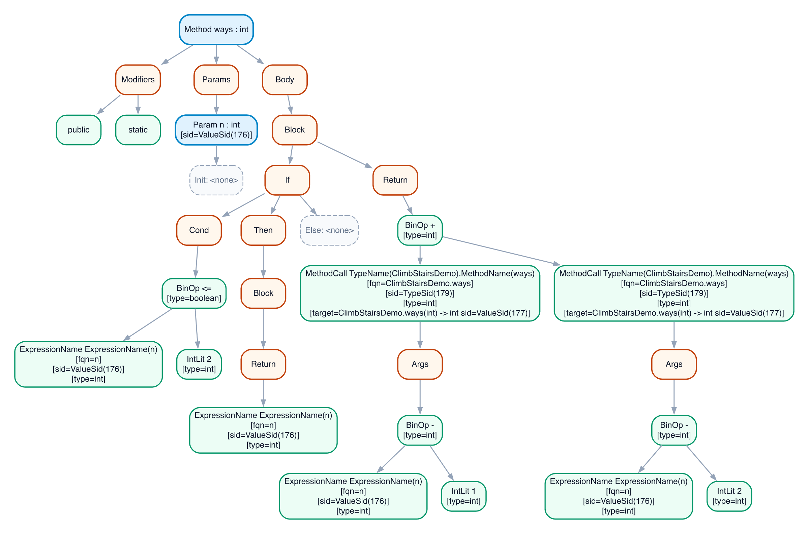

# Joos 1W compiler

We built a compiler for Joos 1W in CS 444 at the University of Waterloo. Joos 1W is a subset of Java 1.3, with classes, interfaces, arrays, inheritance, and enough of the type system to make compilation interesting. Our compiler is written in OCaml. It reads a program across multiple `.java` files, checks it, and emits 32-bit x86 assembly.

The team was Arnav Tripathi, Andreja Japundzic, and me, Ryan Maxin. The compiler source stays private under the course's academic integrity rules, but the reports below document how we built it.

## From source to assembly

| Stage | What happens |
| --- | --- |
| Front end | A hand-built DFA scans the source. An LALR(1) parser builds a parse tree; we turn that into an AST and weed out programs that the grammar alone cannot reject. |
| Middle end | Passes resolve names across files, build class and interface relationships, disambiguate names, check types, and find unreachable code. |
| Back end | The compiler lays out objects and arrays, prepares method dispatch and subtype tables, and generates 32-bit x86 assembly. |

The part that took the most care was carrying meaning from one pass to the next. A name that looks simple in the source can depend on imports, scope, inheritance, and whether it names a type or a value. We used symbol IDs to connect uses to declarations, with side tables for information found later in the pipeline. That let us add the later checks without repeatedly reshaping the AST.

I worked on the scanner and parser infrastructure, AST construction and visualization, symbol binding and hierarchy checking, and later the runtime metadata for object allocation, dispatch, and subtype tests. I also built out the test harness and debug workflow. Arnav and Andreja contributed throughout the scanner, grammar, name resolution, type checking, and code generation. The reports give the full design and individual contributions.

## Inside the compiler

This is a compiler-generated view of a recursive `ways(int n)` method after type checking. The annotations show the resolved calls, symbol IDs, and expression types that later passes use. We generated views like this while debugging the handoff between stages. [Open the full image](image.png).

## Reports

| Report | What it covers |
| --- | --- |
| [A1: Scanner, Parser, AST, and Weeder](CS%20444%20A1%20Report%20%28FINAL%29.pdf) | The scanner DFA, LALR(1) parser, AST construction, weeding, and early tests. |
| [A2–A4: Name Resolution, Type Checking, and Static Analysis](CS%20444%20A2-4%20Report%20%28FINAL%29.pdf) | Cross-file symbols, hierarchy checks, name disambiguation, type checking, and reachability. |
| [A5: Code Generation](CS%20444%20A5%20Report%20%28FINAL%29.pdf) | x86 generation, object and array layouts, dynamic dispatch, runtime type checks, and end-to-end tests. |

The [Joos 1W language reference](https://student.cs.uwaterloo.ca/~cs444/joos.html) describes the Java subset we targeted.
