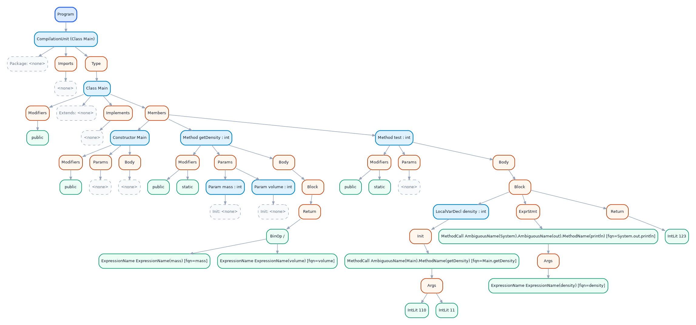
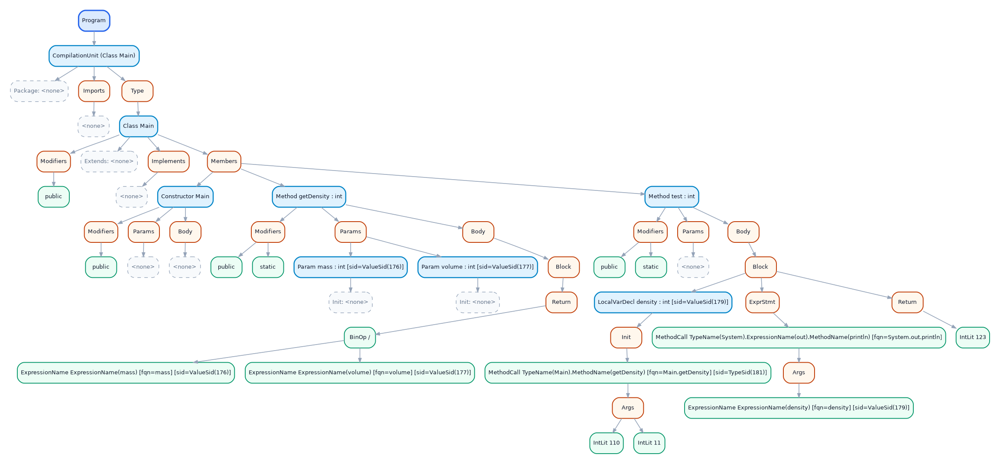

# Joos 1W compiler

We built a compiler for Joos 1W in CS 444 at the University of Waterloo. Joos 1W is a subset of Java 1.3, with classes, interfaces, arrays, inheritance, and enough of the type system to make compilation interesting. Our compiler is written in OCaml. It reads a program across multiple `.java` files, checks it, and emits 32-bit x86 assembly.

The team was Arnav Tripathi, Andreja Japundzic, and me, Ryan Maxin. We don't post the compiler source publicly because of the course's academic integrity rules. The code is available on request.

## Why OCaml

We wanted to try OCaml. We'd also heard that ML languages worked well for compilers, and Dwight VandenBerghe's [case for ML and OCaml](https://flint.cs.yale.edu/cs421/case-for-ml.html) helped convince us. Algebraic data types and pattern matching seemed like a good fit for tokens and trees, and they were. OCaml's type checker caught plenty of mistakes as we added passes.

It was an adjustment, though. Early on, even adding debug output to a function could mean reworking its sequencing. Later, changes to AST variants could ripple through a lot of pattern matches. The A1 and A2–A4 reports say more about both sides of that choice.

## From source to assembly

| Stage      | What happens                                                                                                                                                   |
| ---------- | -------------------------------------------------------------------------------------------------------------------------------------------------------------- |
| Front end  | A hand-built DFA scans the source. An LALR(1) parser builds a parse tree; we turn that into an AST and weed out programs that the grammar alone cannot reject. |
| Middle end | Passes resolve names across files, build class and interface relationships, disambiguate names, check types, and find unreachable code.                        |
| Back end   | The compiler lays out objects and arrays, prepares method dispatch and subtype tables, and generates 32-bit x86 assembly.                                      |

The part that took the most care was carrying meaning from one pass to the next. A name that looks simple in the source can depend on imports, scope, inheritance, and whether it names a type or a value. We used symbol IDs to connect uses to declarations, with side tables for information found later in the pipeline. That let us add the later checks without repeatedly reshaping the AST.

I worked on the scanner and parser infrastructure, AST construction and visualization, symbol binding and hierarchy checking, and later the runtime metadata for object allocation, dispatch, and subtype tests. I also built out the test harness and debug workflow. Arnav and Andreja contributed throughout the scanner, grammar, name resolution, type checking, and code generation. The reports give the full design and individual contributions.

## Inside the compiler

This small Joos program is a useful way to follow one input through the compiler.

### Source

[Main.java](examples/get-density/Main.java)

```java
public class Main {
  public Main() {}

  public static int getDensity(int mass, int volume) {
    return mass / volume;
  }

  public static int test() {
    int density = Main.getDensity(110, 11);
    System.out.println(density);
    return 123;
  }
}
```

### Frontend

After scanning, parsing, AST construction, and weeding, the tree has the program's structure. Calls such as `Main.getDensity` and `System.out.println` still contain ambiguous names at this point.

[](visualizations/ast_after_full_frontend.svg)

[Open the SVG](visualizations/ast_after_full_frontend.svg) or [DOT file](visualizations/ast_after_full_frontend.dot).

### Middle end

After name resolution, disambiguation, type checking, and static analysis, the tree identifies names as types or expressions and attaches symbol IDs to bindings.

[](visualizations/ast_after_full_middle_end.svg)

[Open the SVG](visualizations/ast_after_full_middle_end.svg) or [DOT file](visualizations/ast_after_full_middle_end.dot).

### Assembly

The backend emits 32-bit x86 assembly. This is the generated `getDensity` method, including its divide-by-zero check. The [full assembly file](visualizations/final_assembly.s) also contains `Main.test` and the class metadata.

```nasm
Main.getDensity$178:
push ebp
mov ebp, esp
mov eax, [ebp + 8]
push eax
mov eax, [ebp + 12]
mov ebx, eax
pop eax
cmp ebx, 0
je __exception
cdq
idiv ebx
jmp Main.getDensity$178$end
Main.getDensity$178$end:
mov esp, ebp
pop ebp
ret
```

## Reports

| Report                                                                                                   | What it covers                                                                                         |
| -------------------------------------------------------------------------------------------------------- | ------------------------------------------------------------------------------------------------------ |
| [A1: Scanner, Parser, AST, and Weeder](CS%20444%20A1%20Report%20%28FINAL%29.pdf)                         | The scanner DFA, LALR(1) parser, AST construction, weeding, and early tests.                           |
| [A2–A4: Name Resolution, Type Checking, and Static Analysis](CS%20444%20A2-4%20Report%20%28FINAL%29.pdf) | Cross-file symbols, hierarchy checks, name disambiguation, type checking, and reachability.            |
| [A5: Code Generation](CS%20444%20A5%20Report%20%28FINAL%29.pdf)                                          | x86 generation, object and array layouts, dynamic dispatch, runtime type checks, and end-to-end tests. |

The [Joos 1W language reference](https://student.cs.uwaterloo.ca/~cs444/joos.html) describes the Java subset we targeted.
