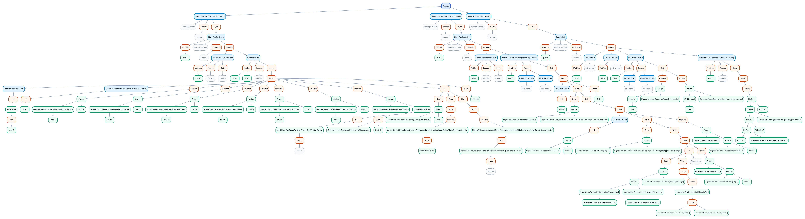

# Joos 1W compiler

We built a compiler for Joos 1W in CS 444 at the University of Waterloo. Joos 1W is a subset of Java 1.3, with classes, interfaces, arrays, inheritance, and enough of the type system to make compilation interesting. Our compiler is written in OCaml. It reads a program across multiple `.java` files, checks it, and emits 32-bit x86 assembly.

The team was Arnav Tripathi, Andreja Japundzic, and me, Ryan Maxin. We don't post the compiler source publicly because of the course's academic integrity rules. The code is available on request.

## Why OCaml

We wanted to try OCaml. We'd also heard that ML languages worked well for compilers, and Dwight VandenBerghe's [case for ML and OCaml](https://flint.cs.yale.edu/cs421/case-for-ml.html) helped convince us. Algebraic data types and pattern matching seemed like a good fit for tokens and trees, and they were. OCaml's type checker caught plenty of mistakes as we added passes.

It was an adjustment, though. Early on, even adding debug output to a function could mean reworking its sequencing. Later, changes to AST variants could ripple through a lot of pattern matches. The A1 and A2–A4 reports say more about both sides of that choice.

## From source to assembly

| Stage | What happens |
| --- | --- |
| Front end | A hand-built DFA scans the source. An LALR(1) parser builds a parse tree; we turn that into an AST and weed out programs that the grammar alone cannot reject. |
| Middle end | Passes resolve names across files, build class and interface relationships, disambiguate names, check types, and find unreachable code. |
| Back end | The compiler lays out objects and arrays, prepares method dispatch and subtype tables, and generates 32-bit x86 assembly. |

The part that took the most care was carrying meaning from one pass to the next. A name that looks simple in the source can depend on imports, scope, inheritance, and whether it names a type or a value. We used symbol IDs to connect uses to declarations, with side tables for information found later in the pipeline. That let us add the later checks without repeatedly reshaping the AST.

I worked on the scanner and parser infrastructure, AST construction and visualization, symbol binding and hierarchy checking, and later the runtime metadata for object allocation, dispatch, and subtype tests. I also built out the test harness and debug workflow. Arnav and Andreja contributed throughout the scanner, grammar, name resolution, type checking, and code generation. The reports give the full design and individual contributions.

## Inside the compiler

This three-file Two Sum example uses arrays, nested loops, object construction, and calls between classes. The source is below; the files are also available as [TwoSumDemo.java](examples/two-sum/TwoSumDemo.java), [TwoSumSolver.java](examples/two-sum/TwoSumSolver.java), and [IntPair.java](examples/two-sum/IntPair.java).

**TwoSumDemo.java**

```java
public class TwoSumDemo {
  public TwoSumDemo() {}

  public static int test() {
    int[] values = new int[6];
    IntPair answer = null;

    values[0] = 4;
    values[1] = 1;
    values[2] = 9;
    values[3] = 3;
    values[4] = 7;
    values[5] = 11;

    answer = new TwoSumSolver().solve(values, 10);

    if (answer == null) {
      System.out.println("not found");
    } else {
      System.out.println(answer.render());
    }

    return 123;
  }
}
```

**TwoSumSolver.java**

```java
public class TwoSumSolver {
  public TwoSumSolver() {}

  public IntPair solve(int[] values, int target) {
    int i = 0;

    while (i < values.length) {
      int j = i + 1;

      while (j < values.length) {
        if (values[i] + values[j] == target) {
          return new IntPair(i, j);
        }
        j = j + 1;
      }

      i = i + 1;
    }

    return null;
  }
}
```

**IntPair.java**

```java
public class IntPair {
  public int first;
  public int second;

  public IntPair(int first, int second) {
    this.first = first;
    this.second = second;
  }

  public String render() {
    return "[" + first + ", " + second + "]";
  }
}
```

### Full frontend tree

This is the **full frontend AST** for all three Two Sum files, rendered from the compiler's [DOT output](visualizations/two-sum-full-frontend.dot). Open the [full-size PNG](visualizations/two-sum-full-frontend.png) or [SVG](visualizations/two-sum-full-frontend.svg) to zoom in.

[](visualizations/two-sum-full-frontend.svg)

## Reports

| Report | What it covers |
| --- | --- |
| [A1: Scanner, Parser, AST, and Weeder](CS%20444%20A1%20Report%20%28FINAL%29.pdf) | The scanner DFA, LALR(1) parser, AST construction, weeding, and early tests. |
| [A2–A4: Name Resolution, Type Checking, and Static Analysis](CS%20444%20A2-4%20Report%20%28FINAL%29.pdf) | Cross-file symbols, hierarchy checks, name disambiguation, type checking, and reachability. |
| [A5: Code Generation](CS%20444%20A5%20Report%20%28FINAL%29.pdf) | x86 generation, object and array layouts, dynamic dispatch, runtime type checks, and end-to-end tests. |

The [Joos 1W language reference](https://student.cs.uwaterloo.ca/~cs444/joos.html) describes the Java subset we targeted.
